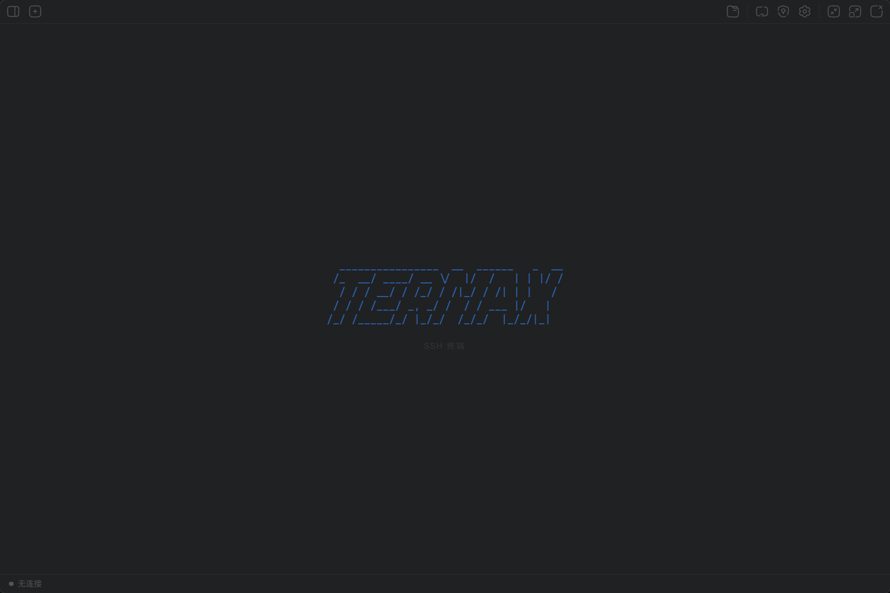

<p align="center">
  
</p>

<h1 align="center">Termax</h1>

<p align="center">
  现代化的 SSH 终端客户端，基于 Tauri v2 构建
</p>

<p align="center">
  <a href="./README.en.md">English</a> · 中文
</p>

<p align="center">
  
  
  
  
</p>

<p align="center">
  
</p>

---

## 功能特性

- **SSH 连接** — 密码认证 / 密钥认证
- **SSH 凭证管理** — AES-256-GCM 加密存储，统一管理密钥与密码认证
- **堡垒机 / 跳板机** — 通过跳板机代理连接目标服务器
- **端口转发** — 本地 / 远程 / 动态端口转发
- **多 Tab 终端** — 拖拽排序、右键菜单、一键重连
- **SFTP 文件浏览器** — 上传 / 下载 / 分块传输进度 / 传输历史 / 取消传输
- **本地终端** — Windows / macOS / Linux 本地 Shell + WSL 支持
- **分屏** — 水平 / 垂直分屏，灵活切换
- **广播输入** — 选择多个终端，同步发送键盘输入
- **系统监控** — CPU / 内存 / 磁盘实时指标
- **调试面板** — IPC 调用计时、FPS / 内存指标、结构化日志导出
- **主题系统** — Termax Dark / Light、One Dark、Dracula，支持自定义扩展
- **国际化** — 中文 / English
- **应用内更新** — 基于 GitHub Releases 的版本检测与更新

**即将推出：**

- 命令片段
- Android 移动端适配

## 技术栈

| 层级 | 技术 |
|------|------|
| 前端 | React 19 + TypeScript + Tailwind CSS v4 + Zustand + xterm.js |
| 后端 | Rust + Tauri v2 + russh + tokio |
| 构建 | Vite 8 + pnpm + GitHub Actions |

## 快速开始

### 环境要求

- [Node.js](https://nodejs.org/) >= 18
- [Rust](https://www.rust-lang.org/) >= 1.85
- [pnpm](https://pnpm.io/) >= 9

### 安装依赖

```bash
pnpm install
```

### 开发与构建命令

| 命令 | 说明 |
|------|------|
| `pnpm dev` | 启动开发模式（热重载） |
| `pnpm build` | 构建前端（类型检查 + Vite 打包） |
| `pnpm build:nsis` | 构建 Windows NSIS 安装包（`.exe`） |
| `pnpm build:msi` | 构建 Windows MSI 安装包 |
| `pnpm build:portable` | 构建 Windows 免安装便携版 |
| `pnpm lint` | ESLint 代码检查 |
| `pnpm gen:installer-assets` | 生成安装程序位图资源 |

## 下载安装

从 [GitHub Releases](https://github.com/openmaxnet/Termax/releases) 下载最新版本：

| 平台 | 格式 | 状态 |
|------|------|------|
| Windows | `.exe` 安装包 / 便携版 | ✅ 已支持 |
| macOS | `.dmg` | 🚧 即将支持 |
| Linux | `.deb` / `.AppImage` | 🚧 即将支持 |

## 项目结构

```
Termax/
├── src-tauri/                # Rust 后端
│   ├── src/
│   │   ├── commands/         # Tauri IPC 命令（薄层）
│   │   ├── ssh/              # SSH 业务逻辑
│   │   ├── sftp/             # SFTP 文件操作
│   │   ├── local/            # 本地终端 PTY
│   │   ├── monitor/          # 系统监控
│   │   └── storage/          # 持久化存储（SQLite）
│   └── Cargo.toml
├── src/                      # React 前端
│   ├── app/                  # 应用外壳（TitleBar / Sidebar / StatusBar）
│   ├── features/             # 功能模块
│   │   ├── terminal/         # 终端
│   │   ├── connection/       # 连接管理
│   │   ├── credential/       # SSH 凭证管理
│   │   ├── sftp/             # SFTP 文件浏览器
│   │   ├── monitoring/       # 系统监控
│   │   └── settings/         # 设置
│   ├── ui/                   # 通用 UI 组件库（T 前缀）
│   ├── hooks/                # 通用 Hooks
│   ├── stores/               # Zustand 状态管理
│   ├── lib/                  # 工具函数 + IPC 接口层
│   ├── i18n/                 # 国际化
│   └── themes/               # 终端配色方案
├── .github/workflows/        # GitHub Actions CI/CD
└── package.json
```

## 开发指南

### 代码规范

- 详见 [CLAUDE.md](./CLAUDE.md) 中的完整编码规范
- CSS 变量使用 `--tx-` 前缀
- 通用 UI 组件使用 `T` 前缀，放在 `src/ui/`
- IPC 调用通过 `ipc` 对象，不直接调用 `invoke()`

## 许可证

[MIT License](./LICENSE)
